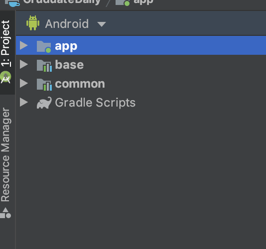
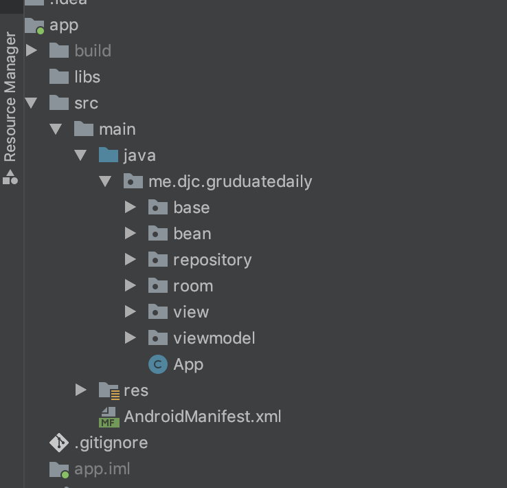
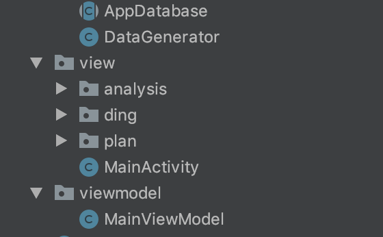
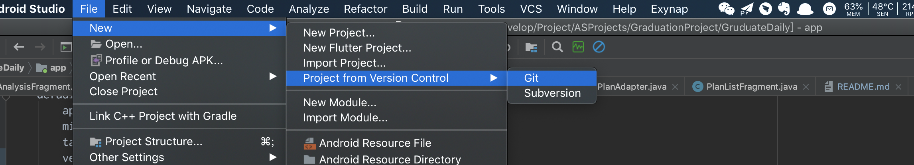
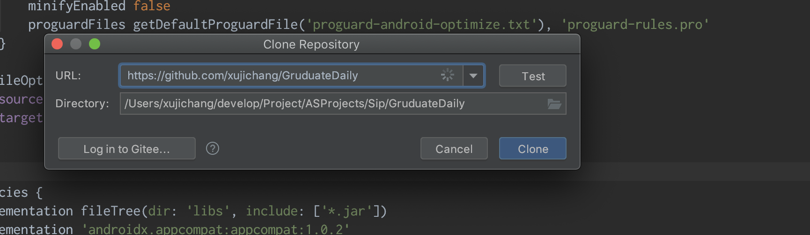

# GruduateDaily

《考研日记》毕设项目地址：[https://github.com/xujichang/GruduateDaily](https://github.com/xujichang/GruduateDaily)

#### 一、代码说明

- **首先代码基本组织说明：** 

  > 

代码组织分为三模块：app、base、common

                app是程序运行模块，base是基本类所在在，common作为项目中抽出的共用方法、共用逻辑。

- **主模块“app”代码组织结构**

  > 

1. APP: 为程序入口

2. base: 为项目基类所在，包含项目的共用方法，项目开发中的一些方法会慢慢沉淀为基类

3. bean: 为项目中所用到的实体类，即基本数据类，用来定义项目中的基本对象

4. repository: 数据请求逻辑所在，本项目中，暂时用不到网络请求，所以暂时仅仅是将操作数据存储在数据库

5. room： 数据库操作抽象层，将数据操作对象化，方便对数据的操作，

6. view: 项目中UI所在，主要负责界面绘制

7. viewmodel: 作为UI层数据逻辑的处理层

- **View层代码组织结构**

  > 

按照项目中的模块组织分为：analysis 数据统计模块、ding 打开模块 、plan 计划模块

#### 二、用到的主要开源库

- **Google Guava**：google 开源的工具类库

- **Glide 图片加载**

- **MPAndroidChart**：图表制作开源库

- **Navigation** : google 推出的Fragment管理框架，旨在努力实现项目中维护一个Activity

- **Room**： google 开源 数据库框架

- **Calendarview**: 开源日历控件

- 其他开源库

#### 三、AndroidStudio 导入

1. **首先找到Git位置**

   

2. **输入项目地址**

   

3. **点击*clone*即可**

#### 四、运行条件

- AndroidSDK 

- JavaSDK

- AndroidStudio

- 
